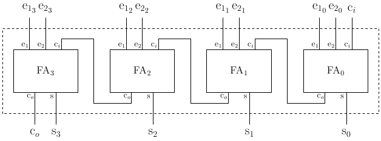
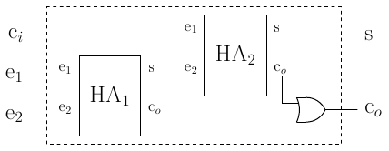
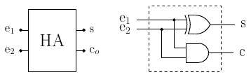

# SUMADOR DE 4 BITS

Crear un módulo sumador de 4 bits con propagación de acarreo tal y como se muestra en la siguiente imagen:

Utilizar las siguientes imágenes como referencia a la hora de crear los componente del sumador:

