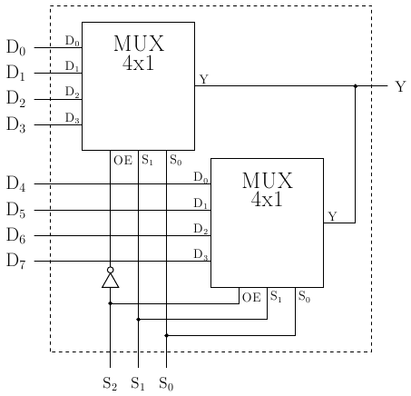
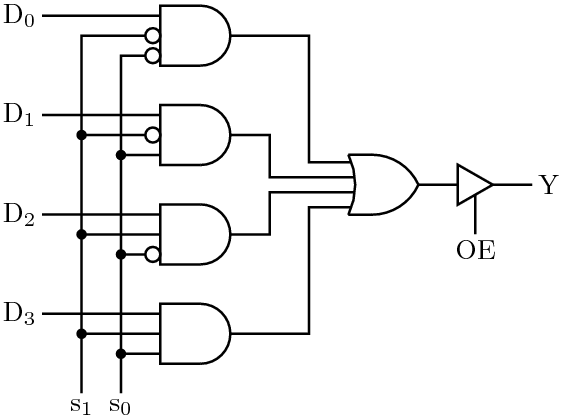

# CREACIÓN DE UN MULTIPLEXOR SOFTWARE 4 A 1 CON DEFINICIÓN LÓGICA

Constrúyase un módulo multiplexor 4x1 con línea de control de salida OE, de modo que si dicha línea está inactiva, la salida Y esté en alta impedancia. En caso contrario, funciona como multiplexor normal. Con dos de estos multiplexores constrúyase otro módulo multiplexor 8x1 según el esquema de la figura. Pruébese con ayuda de un módulo auxiliar.

Pista: si no sois capaces de construir el multiplexor 4x1, podéis fijaros en esta solución. Hay alternativas similares a la solución de la figura que usan un decodificador o búferes triestado, por ejemplo.

